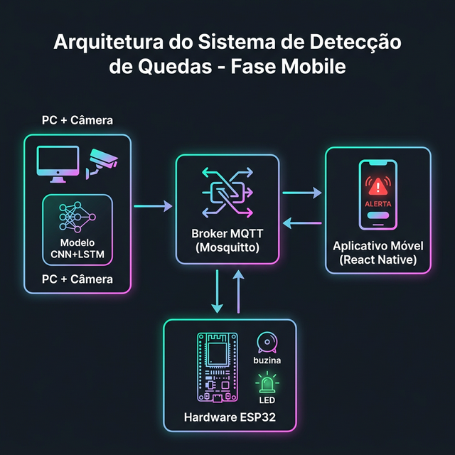
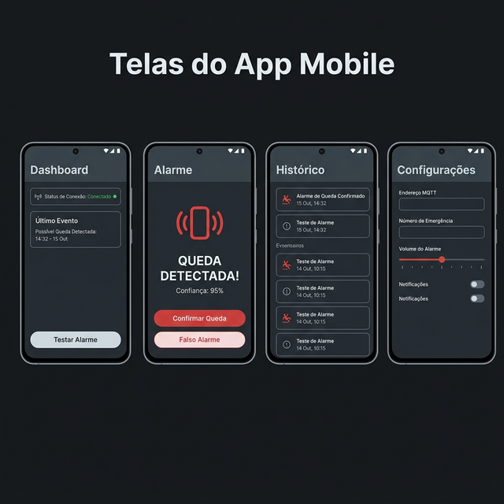
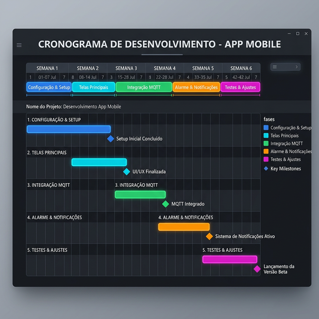

# 📱 Relatório de Atividades — Fase Mobile
## Sistema de Detecção de Quedas com IA

**Projeto:** PAIC/FAPEAM — Universidade do Estado do Amazonas (UEA)  
**Autor:** Nelson Emeliano Silva  
**Orientador:** Prof. Angilberto Muniz Ferreira Sobrinho  
**Data:** Março/2026  
**Fase:** Desenvolvimento do Aplicativo Mobile

---

## 1. Introdução

Este relatório documenta a fase mobile do projeto de Detecção de Quedas com IA: o desenvolvimento de um **aplicativo mobile para Android** capaz de receber alertas em tempo real quando o sistema detecta uma queda, emitindo alarmes sonoros e visuais no smartphone do cuidador ou familiar.

### 1.1 Contexto

As fases anteriores do projeto resultaram em:
- Um **modelo híbrido CNN+LSTM** (MobileNetV2 + LSTM) treinado no dataset UR Fall Detection
- Um sistema de **detecção em tempo real** via câmera de vídeo
- **Integração com ESP32** para alarmes locais (buzzer + LEDs) via Serial/MQTT

### 1.2 Objetivo da Fase Mobile

Desenvolver um aplicativo Android que:
1. Receba alertas de queda em tempo real via protocolo MQTT
2. Emita alarmes sonoros e visuais no dispositivo móvel
3. Permita ao cuidador confirmar ou descartar o alerta
4. Mantenha um histórico de eventos para acompanhamento
5. Ofereça acesso rápido à discagem de emergência

---

## 2. Arquitetura do Sistema

### 2.1 Visão Geral

A arquitetura integra o sistema existente (PC + ESP32) com o aplicativo mobile através de um broker MQTT centralizado.



### 2.2 Componentes

| Componente | Tecnologia | Função |
|---|---|---|
| **Módulo de Detecção** | Python + TensorFlow | Processa vídeo da câmera e detecta quedas usando CNN+LSTM |
| **Broker MQTT** | Eclipse Mosquitto | Hub central de mensagens — distribui alertas para todos os assinantes |
| **App Mobile** | React Native + Expo | Recebe alertas e notifica o cuidador com alarme sonoro/visual |
| **Hardware ESP32** | Arduino + WiFi | Dispara alarme local (buzzer + LEDs) |

### 2.3 Fluxo de Dados

```
┌─────────────────────────────────────────────────────────────────┐
│                     FLUXO DE DETECÇÃO                           │
├─────────────────────────────────────────────────────────────────┤
│                                                                 │
│  1. CAPTURA          2. PROCESSAMENTO       3. CLASSIFICAÇÃO    │
│  ┌──────────┐       ┌──────────────┐       ┌──────────────┐    │
│  │ Câmera   │──────►│ MobileNetV2  │──────►│    LSTM      │    │
│  │ (Webcam) │ Frame │ (Extração de │ Vetor │ (Análise     │    │
│  └──────────┘       │ Features)    │       │  Temporal)   │    │
│                     └──────────────┘       └──────┬───────┘    │
│                                                    │            │
│                                          Queda? (>70%)          │
│                                                    │            │
│  4. DISTRIBUIÇÃO                                   ▼            │
│  ┌──────────────────────────────────────────────────────┐       │
│  │              BROKER MQTT (Mosquitto)                  │       │
│  │      Tópico: fall_detection/alerts                    │       │
│  │      Portas: 1883 (MQTT) + 9001 (WebSocket)          │       │
│  └──────┬───────────────────────────────────┬───────────┘       │
│         │                                   │                    │
│         ▼                                   ▼                    │
│  ┌──────────────┐                   ┌──────────────┐            │
│  │  App Mobile  │                   │    ESP32     │            │
│  │  📱 Alarme   │                   │  🔔 Buzzer   │            │
│  │  📞 Emergência│                  │  🔴 LEDs     │            │
│  └──────────────┘                   └──────────────┘            │
│                                                                 │
└─────────────────────────────────────────────────────────────────┘
```

### 2.4 Protocolo de Comunicação — MQTT

O protocolo MQTT (Message Queuing Telemetry Transport) foi escolhido por:
- **Leveza**: ideal para IoT e dispositivos com recursos limitados
- **Baixa latência**: essencial para alertas em tempo real
- **Padrão publish/subscribe**: permite múltiplos assinantes sem acoplamento
- **Já implementado**: o backend Python e o ESP32 já suportam MQTT

O app mobile conecta-se ao broker via **WebSocket** (porta 9001), pois o runtime JavaScript do React Native não suporta conexões TCP nativas. O Mosquitto foi configurado com dois listeners: MQTT puro na porta 1883 (para o Python e ESP32) e WebSocket na porta 9001 (para o app).

**Formato da mensagem de alerta:**
```json
{
  "alert": "FALL_DETECTED",
  "confidence": 0.95,
  "timestamp": "2026-03-22T15:30:45.123456",
  "metadata": {
    "frame_id": 1234,
    "model": "CNN-LSTM"
  }
}
```

---

## 3. Stack Tecnológico


### 3.1 Detalhamento

| Camada | Tecnologia | Versão | Justificativa |
|---|---|---|---|
| **Frontend Mobile** | React Native | 0.81.5 | Framework cross-platform mais popular, grande comunidade |
| **Toolchain Mobile** | Expo | SDK 54 | Simplifica build, deploy e testes — ideal para protótipos rápidos |
| **Linguagem Mobile** | TypeScript | 5.x | Tipagem estática para maior segurança no tratamento de payloads MQTT |
| **Protocolo IoT** | MQTT | v3.1.1 | Leve, baixa latência, padrão pub/sub |
| **Broker MQTT** | Eclipse Mosquitto | 2.x | Open source, leve, amplamente utilizado |
| **Backend IA** | Python 3.10+ | — | Ecossistema maduro para ML/DL |
| **Deep Learning** | TensorFlow/Keras | 2.x | Framework robusto para CNN+LSTM |
| **Visão Computacional** | OpenCV | 4.x | Processamento de vídeo em tempo real |
| **Hardware** | ESP32 + Arduino | — | Microcontrolador WiFi/BT de baixo custo |

### 3.2 Dependências do App Mobile

| Pacote npm | Função |
|---|---|
| `mqtt` (v5.x) | Cliente MQTT para JavaScript — conexão WebSocket com o broker |
| `expo-av` | Reprodução de áudio (alarme sonoro em loop) |
| `expo-haptics` | Vibração do dispositivo durante alarme |
| `expo-notifications` | Notificações push locais |
| `@react-navigation/native` | Navegação entre telas do app |
| `@react-navigation/bottom-tabs` | Barra de abas inferior (4 telas) |
| `@react-native-async-storage/async-storage` | Persistência local (histórico de eventos, configurações) |
| `@expo/vector-icons` | Ícones (Ionicons) para interface |

---

## 4. Design do Aplicativo

### 4.1 Telas Implementadas



### 4.2 Descrição das Telas

#### Tela 1 — Dashboard (Tela Principal)
- **Indicador de status** da conexão MQTT (conectado/conectando/desconectado/erro)
- **Botão Conectar/Desconectar** para controle manual da conexão MQTT
- **Card do último evento** com timestamp e nível de confiança
- **Contadores** de alertas do dia e da semana
- **Botão "Testar Alarme"** para verificar funcionamento sem depender do broker

#### Tela 2 — Alarme de Queda
- **Modo inativo**: ícone de escudo verde com mensagem "Tudo Normal"
- **Modo ativo** (ativado automaticamente ao receber FALL_DETECTED):
  - Alarme sonoro em loop (tom alternado 880/660 Hz) + vibração contínua
  - Indicador de confiança da detecção e timestamp
  - **Botão "Confirmar Queda"** → registra evento como confirmado
  - **Botão "Falso Alarme"** → silencia e registra como falso positivo
  - **Botão "Ligar Emergência"** → discagem direta para o número configurado
- Badge "!" na aba quando alarme está ativo

#### Tela 3 — Histórico de Eventos
- Lista cronológica de todos os alertas recebidos (persistida via AsyncStorage)
- **Filtros por tipo**: Todos, Confirmados, Falso Alarme, Pendentes, Testes
- Classificação visual com ícones e cores por status
- **Botão "Limpar"** para apagar todo o histórico
- Informações por evento: data/hora, confiança, resposta do cuidador

#### Tela 4 — Configurações
- **Conexão MQTT**: endereço IP do broker, porta WebSocket, tópico (campos travados enquanto conectado)
- **Emergência**: número de telefone para discagem rápida
- **Alarme**: limiar de confiança mínimo para acionar alarme (padrão: 70%)
- **Notificações**: toggle para ativar/desativar notificações push
- Todas as configurações são persistidas no AsyncStorage

---

## 5. Implementação Realizada

### 5.1 Estrutura do Projeto

```
mobile/FallDetectApp/
├── App.tsx                          # Ponto de entrada, navegação bottom-tabs, AppProvider
├── app.json                         # Configuração Expo
├── package.json                     # Dependências npm
├── tsconfig.json                    # Configuração TypeScript
├── index.ts                         # Entry point Expo
├── assets/
│   └── alarm.wav                    # Som do alarme (3s, tom alternado 880/660 Hz)
└── src/
    ├── context/
    │   └── AppContext.tsx            # Estado global (useReducer + Context API)
    ├── services/
    │   ├── MqttService.ts           # Conexão MQTT via WebSocket, subscribe, reconexão
    │   ├── AlarmService.ts          # Reprodução de som em loop + vibração contínua
    │   └── EventStorage.ts          # Persistência no AsyncStorage (eventos + configurações)
    ├── screens/
    │   ├── DashboardScreen.tsx      # Tela principal com status e estatísticas
    │   ├── AlarmScreen.tsx          # Tela de alarme (modo inativo / modo ativo)
    │   ├── HistoryScreen.tsx        # Histórico com filtros e botão limpar
    │   └── SettingsScreen.tsx       # Configurações do broker e alarme
    ├── components/
    │   ├── StatusBadge.tsx          # Indicador visual de conexão MQTT
    │   └── EventCard.tsx            # Card de evento para listas
    ├── types/
    │   └── index.ts                 # Tipos TypeScript (FallAlertPayload, FallEvent, AppSettings)
    └── theme/
        └── colors.ts                # Paleta de cores do dark theme
```

### 5.2 Arquitetura de Software do App

O app utiliza a **Context API** do React com `useReducer` para gerenciamento de estado global. A arquitetura separa claramente as responsabilidades:

```
AppProvider (Context + Reducer)
├── MqttService (singleton)      → Gerencia conexão WebSocket com o broker
├── AlarmService (singleton)     → Controla som e vibração
├── EventStorage (módulo)        → Lê/grava no AsyncStorage
│
└── Screens (consumers)
    ├── Dashboard  → lê: mqttStatus, events     | chama: connect, disconnect, testAlarm
    ├── Alarme     → lê: alarmActive, alert      | chama: confirmAlarm, dismissAlarm
    ├── Histórico  → lê: events                  | chama: clearEvents
    └── Configurações → lê: settings             | chama: updateSettings
```

**Actions do reducer:**
| Action | Efeito |
|---|---|
| `MQTT_STATUS` | Atualiza status de conexão (connected/disconnected/connecting/error) |
| `ALERT_RECEIVED` | Cria evento, ativa alarme, navega para aba Alarme |
| `ALARM_CONFIRMED` | Para alarme, marca evento como "confirmado" |
| `ALARM_DISMISSED` | Para alarme, marca evento como "falso alarme" |
| `UPDATE_SETTINGS` | Atualiza configurações (persiste automaticamente) |
| `LOAD_PERSISTED` | Carrega eventos e settings salvos ao iniciar o app |
| `CLEAR_EVENTS` | Limpa todo o histórico |

### 5.3 Fluxo de Recepção de Alerta

1. `MqttService` recebe mensagem JSON no tópico `fall_detection/alerts`
2. Valida se `alert` é `FALL_DETECTED` ou `TEST`
3. Verifica se `confidence` ≥ limiar configurado (padrão: 70%)
4. Dispara action `ALERT_RECEIVED` no reducer
5. `AlarmService.start()` inicia som em loop + vibração a cada 800ms
6. Navegação automática para a aba Alarme
7. Badge "!" aparece na aba Alarme
8. Evento é adicionado ao histórico e persistido no AsyncStorage
9. Cuidador responde com "Confirmar Queda" ou "Falso Alarme"
10. Alarme é silenciado e evento é classificado

### 5.4 Configuração do Broker MQTT

O Mosquitto foi configurado com dois listeners para suportar tanto o backend Python (MQTT puro) quanto o app mobile (WebSocket):

```
# /etc/mosquitto/conf.d/websocket.conf
listener 1883
allow_anonymous true

listener 9001
protocol websockets
allow_anonymous true
```

---

## 6. Cronograma de Desenvolvimento



### 6.1 Progresso Atual

| Etapa | Status | Descrição |
|---|---|---|
| **Etapa 1 — Setup & Esqueleto** | ✅ Concluída | Projeto Expo criado (SDK 54, TypeScript), dependências instaladas, navegação bottom-tabs, tema escuro, 4 telas estáticas |
| **Etapa 2 — MQTT + Alarme** | ✅ Concluída | MqttService via WebSocket, AlarmService (som + vibração), AppContext com useReducer, navegação automática ao alarme, botões confirmar/descartar/emergência |
| **Etapa 3 — Histórico + Persistência** | ✅ Concluída | EventStorage com AsyncStorage, eventos e configurações persistidos, filtros no histórico (5 categorias), botão limpar histórico |
| **Etapa 4 — Notificações + Polish** | ⬜ Pendente | Notificações push em background, animações na tela de alarme, testes integrados com sistema completo |

### 6.2 Marcos Atingidos

| Marco | Status | Descrição |
|---|---|---|
| **M1 — Setup Concluído** | ✅ | Projeto Expo criado, broker MQTT operacional com WebSocket |
| **M2 — UI/UX Finalizada** | ✅ | 4 telas implementadas com dark theme e navegação |
| **M3 — MQTT Integrado** | ✅ | App recebe alertas do PC via MQTT em tempo real |
| **M4 — Alarme Funcional** | ✅ | Som, vibração e navegação automática funcionando |
| **M5 — Persistência** | ✅ | Histórico e configurações persistem entre sessões |
| **M6 — Versão Beta** | ⬜ | Pendente: notificações em background e testes finais |

---

## 7. Testes Realizados

### 7.1 Teste de Conexão MQTT
- App conecta ao broker Mosquitto local via WebSocket (porta 9001)
- Indicador de status reflete o estado real da conexão em tempo real
- Reconexão automática quando a conexão é perdida

### 7.2 Teste de Alarme via mosquitto_pub
```bash
mosquitto_pub -t "fall_detection/alerts" \
  -m '{"alert":"FALL_DETECTED","confidence":0.92,"timestamp":"2026-03-22T15:30:00","metadata":{"frame_id":42,"model":"CNN-LSTM"}}'
```
- App navega automaticamente para aba Alarme
- Som de alarme toca em loop + vibração contínua
- Confiança (92%) e timestamp exibidos corretamente
- Botões "Confirmar Queda" e "Falso Alarme" silenciam o alarme e classificam o evento

### 7.3 Teste de Alarme Local
- Botão "Testar Alarme" no Dashboard dispara alarme sem depender do broker
- Evento registrado no histórico como tipo "teste"

### 7.4 Teste de Persistência
- Eventos e configurações permanecem após fechar e reabrir o app
- Filtros no histórico funcionam corretamente

---

## 8. Mudanças no Sistema Existente

### 8.1 Alterações Realizadas

| Arquivo/Componente | Mudança |
|---|---|
| Eclipse Mosquitto | Instalado e configurado com listener WebSocket na porta 9001 |

### 8.2 Alterações Necessárias para Integração Completa

| Arquivo | Mudança |
|---|---|
| `configs/config.py` | Alterar `ESP32_CONNECTION_TYPE` para `"mqtt"`, descomentar e configurar `ESP32_BROKER`, `ESP32_PORT` e `ESP32_TOPIC` |
| `scripts/main_with_esp32.py` | Adicionar `ESP32_BROKER` e `ESP32_TOPIC` ao import de `configs.config` |

### 8.3 Componentes Sem Alteração

- ✅ `src/model.py` — Modelo CNN+LSTM (sem mudanças)
- ✅ `src/esp32_interface.py` — Já suporta MQTT (sem mudanças)
- ✅ `hardware/esp32_fall_alert.ino` — Já suporta MQTT (só descomentar)

### 8.4 Compatibilidade

O app mobile **não substitui** o ESP32 — ambos funcionam em paralelo:
- **ESP32**: alarme físico no ambiente (para a pessoa que caiu)
- **App Mobile**: alarme remoto para o cuidador/familiar (pode estar em outro local)

---

## 9. Requisitos e Pré-requisitos

### 9.1 Requisitos de Software
- [x] Node.js 18+ (instalado: v24.14.0)
- [x] npm 11+ (instalado: 11.9.0)
- [x] Expo SDK 54
- [x] Eclipse Mosquitto com WebSocket habilitado
- [x] App Expo Go (v54) no celular Android

### 9.2 Requisitos de Hardware
- PC com câmera (já existente)
- Celular Android 6.0+ com Expo Go instalado
- PC e celular na mesma rede WiFi

### 9.3 Requisitos de Rede
- Porta 1883 (MQTT) liberada no firewall do PC
- Porta 9001 (WebSocket) liberada no firewall do PC
- Comunicação na rede local (mesmo WiFi)

---

## 10. Riscos e Mitigações

| Risco | Impacto | Mitigação | Status |
|---|---|---|---|
| Latência na rede WiFi | Atraso no alarme mobile | Broker MQTT local; QoS 1 | ✅ Mitigado |
| App em segundo plano (Android mata processos) | Alarme não toca | Implementar notificações push locais | ⬜ Pendente (Etapa 4) |
| Perda de conexão MQTT | App para de receber alertas | Reconexão automática com período de 5s | ✅ Implementado |
| Falsos positivos do modelo | Alarmes desnecessários | Limiar de confiança configurável no app (padrão: 70%) | ✅ Implementado |
| Firewall bloqueando MQTT/WebSocket | Conexão falha | Documentação de configuração de rede | ✅ Documentado |
| Perda de dados ao fechar app | Histórico perdido | AsyncStorage com persistência automática | ✅ Implementado |

---

## 11. Próximos Passos

### Etapa 4 — Notificações em Background + Polish (Pendente)

1. ⬜ **Notificações push locais** via `expo-notifications` quando o app está em segundo plano, garantindo que o cuidador seja alertado mesmo sem estar olhando o app
2. ⬜ **Animação pulsante** na tela de alarme para maior impacto visual
3. ⬜ **Testes integrados** com o sistema completo: `main_with_esp32.py` em modo MQTT → Mosquitto → App + ESP32 simultaneamente
4. ⬜ **Ajuste do backend Python**: ativar MQTT no `configs/config.py` e corrigir import no `main_with_esp32.py`
5. ⬜ **Build de produção**: gerar APK ou AAB para instalação direta no Android sem Expo Go

---

## 12. Referências

- **UR Fall Detection Dataset**: Kwolek, B., & Kepski, M. (2014). Human fall detection on embedded platform using depth maps and wireless accelerometer. *Computer Methods and Programs in Biomedicine*, 117(3), 489-501.
- **React Native**: https://reactnative.dev/
- **Expo**: https://expo.dev/
- **Eclipse Mosquitto**: https://mosquitto.org/
- **MQTT Protocol**: https://mqtt.org/
- **MobileNetV2**: Sandler, M., et al. (2018). MobileNetV2: Inverted Residuals and Linear Bottlenecks. *CVPR*.
- **mqtt.js**: https://github.com/mqttjs/MQTT.js

---

*Documento atualizado em Março/2026 como parte do Projeto PAIC/FAPEAM — UEA*
